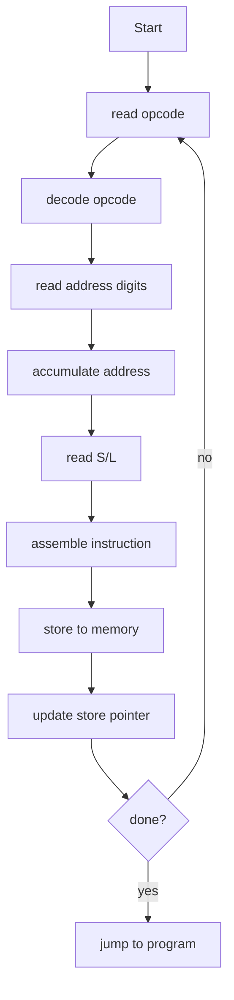
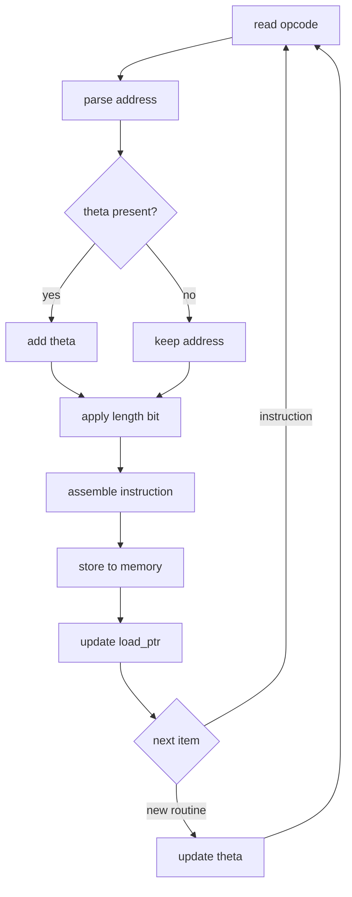

# EDSAC과 Initial Orders: 최초의 로더와 어셈블러

## 1. 개요

EDSAC은 최초의 실용적인 저장 프로그램 컴퓨터 중 하나이며, Initial Orders는 그 위에서 동작한 초기 로더이자 어셈블러 시스템이다.

핵심 구성은 다음과 같다.

| 구분 | 내용 |
| --- | --- |
| 하드웨어 | EDSAC |
| 소프트웨어 | Initial Orders |
| 프로그래밍 개념 | Wheeler Jump |

Initial Orders의 핵심 역할은 종이테이프에 적힌 사람이 읽을 수 있는 명령 표기를 읽고, 이를 기계가 실행할 수 있는 명령으로 바꾸어 메모리에 적재한 뒤 실행을 시작하는 것이다.

---

## 2. EDSAC 시스템 구조

### 메모리 구조

EDSAC의 메모리는 512개의 35비트 word로 구성되며, 이를 1024개의 17비트 half-word로 나누어 다룰 수 있다.

```text
512 words (각 35비트)
→ 1024 half-words (각 17비트)
```

표기는 다음과 같다.

```text
w[n]  → 35-bit word
m[n]  → 17-bit half-word
```

word와 half-word의 관계는 개념적으로 다음과 같이 볼 수 있다.

```text
w[2n] = m[2n+1] + padding + m[2n]
```

### 레지스터

EDSAC의 주요 레지스터는 다음과 같다.

```text
ABC → 71-bit accumulator
AB  → 상위 35비트
A   → 상위 17비트

RS → multiplier register (35-bit)
R  → 상위 17비트
```

---

## 3. 핵심 인물

### 모리스 윌크스

모리스 윌크스는 EDSAC의 설계와 시스템 구축을 총괄했다. EDSAC은 저장 프로그램 개념을 실제 계산 서비스로 구현한 중요한 초기 컴퓨터였다.

### 데이비드 휠러

데이비드 휠러는 Initial Orders와 서브루틴 개념의 발전에 크게 기여했다. 특히 Wheeler Jump는 함수 호출과 복귀 주소 처리의 초기 형태로 볼 수 있다.

---

## 4. Wheeler Jump

Wheeler Jump의 핵심은 서브루틴을 실행한 뒤 호출한 위치로 돌아오는 것이다.

```text
Jump → Subroutine 실행 → 원래 위치로 복귀
```

현대적 대응 관계는 다음과 같다.

```text
function call
return address
modular programming
```

EDSAC에는 현대 CPU의 `CALL`이나 `RET` 같은 명령이 없었기 때문에, 복귀 주소를 처리하기 위해 명령어 자체를 조작하는 방식이 사용되었다. 이는 저장 프로그램 컴퓨터에서 명령어도 메모리에 저장된 데이터처럼 다룰 수 있다는 사실에 기반한다.

---

## 5. Initial Orders 개념

Initial Orders는 EDSAC을 사용할 수 있게 하는 초기 부트스트랩 절차이자 어셈블러 역할을 하는 프로그램이다.

```text
초기 부트스트랩 + 어셈블러
```

주요 역할은 다음과 같다.

- 종이테이프 읽기
- 문자 표기를 기계어 명령으로 변환
- 변환된 명령을 메모리에 적재
- 사용자 프로그램 실행 시작

주요 특징은 다음과 같다.

```text
self-modifying code
symbolic assembly
relocation (Initial Orders 2)
```

---

## 6. EDSAC 명령어 체계

EDSAC 명령어는 사람이 읽을 때 대체로 다음과 같은 형식으로 표현된다.

```text
[ opcode ][ address ][ S/L ]
```

내부적으로는 다음과 같은 필드로 구성된다.

```text
[ opcode (5bit) ][ unused ][ address (10bit) ][ S/L ]
```

예시는 다음과 같다.

```text
A100S
→ add m[100] (short)
```

주요 명령어는 다음과 같다.

```text
A n → add
S n → subtract
T n → store + clear
U n → store (no clear)
E n → jump if ≥0
G n → jump if <0
I n → input
O n → output
R n → shift right
L n → shift left
V n → multiply-add
Z   → stop
```

---

## 7. Initial Orders 전체 흐름

Initial Orders는 입력된 명령을 읽고, opcode와 주소와 길이 정보를 조립한 뒤 메모리에 저장한다.



---

## 8. 메모리 변수 역할

Initial Orders는 매우 작은 메모리 영역 안에서 상태를 관리한다.

```text
m[0]  → opcode field
m[1]  → address accumulator
m[2]  → input char / constant
m[3]  → junk
m[4]  → constant 2
m[5]  → constant 10
m[25] → self-modifying store instruction
m[31+] → user program
```

여기서 중요한 지점은 `m[25]`이다. 이 위치에는 다음 명령을 어디에 저장할지 결정하는 저장 명령이 들어 있으며, Initial Orders는 이 명령 자체를 바꾸면서 적재 위치를 앞으로 이동시킨다.

---

## 9. Initial Orders 1의 명령 흐름

### 초기 설정

```text
0  T0S   → clear accumulator
1  H2S   → R = 10<<11
2  T0S   → clear + data 역할
3  E6S   → jump to main loop
4  P1S   → constant 2
5  P5S   → constant 10
```

### 메인 루프 시작

```text
6  T0S   → reset
7  I0S   → read opcode
8  A0S   → load opcode
9  R16S  → align bits
10 T0L   → store opcode field
```

### 주소 파싱

```text
11 I2S   → read char
12 A2S   → load
13 S5S   → subtract 10
14 E21S  → if not digit → end
```

숫자 문자를 읽은 경우에는 다음 방식으로 주소를 누적한다.

```text
15 T3S   → clear
16 V1S   → multiply by 10
17 L8S   → shift
18 A2S   → add digit
19 T1S   → store address
20 E11S  → loop
```

주소 누적 과정은 개념적으로 다음과 같다.

```text
address = address * 10 + digit
```

### 명령어 조립

```text
21 R4S   → derive length bit
22 A1S   → add address
23 L0L   → align
24 A0S   → add opcode
```

### 저장

```text
25 T31S  → store instruction
```

### 자기 수정 코드

```text
26 A25S  → load TnS
27 A4S   → +2 (address++)
28 U25S  → update
```

이 부분은 `T31S`를 `T32S`, `T33S`처럼 바꾸어 다음 저장 위치를 갱신한다.

```text
T31S → T32S → T33S → ...
```

### 종료 판정

```text
29 S31S  → compare with first instruction
30 G6S   → if not done → loop
```

종료 조건이 만족되면 제어 흐름은 `m[31]`로 이어지고, 그 위치부터 사용자 프로그램이 실행된다.

```text
fall-through → loc 31 → user program 실행
```

---

## 10. Initial Orders 1의 설계 특징

### 자기 수정 코드

Initial Orders는 명령어를 데이터처럼 읽고 고치는 저장 프로그램 컴퓨터의 성질을 직접 활용한다. 특히 저장 명령 자체의 주소 필드를 갱신해 다음 적재 위치를 관리한다.

### 십진수 주소 파싱

사용자는 주소를 십진수 문자로 입력할 수 있다. Initial Orders는 이를 내부 이진 명령 필드로 변환한다.

```text
address = address * 10 + digit
```

### 극단적 미니멀리즘

Initial Orders 1은 약 31개의 명령으로 로더와 어셈블러의 핵심 기능을 수행한다.

```text
31 instructions (IO1)
41 instructions (IO2)
```

### 기호적 조립

사용자는 `A100S`처럼 사람이 읽을 수 있는 표기를 사용하고, Initial Orders는 이를 실제 기계 명령으로 조립한다.

```text
A100S → binary instruction
```

---

## 11. Initial Orders 2와 재배치

Initial Orders 1은 프로그램을 고정된 위치에 적재하는 데 적합했다. 그러나 서브루틴을 재사용하려면 코드가 어디에 놓이든 동작해야 한다. 이 문제를 해결한 것이 Initial Orders 2의 재배치 기능이다.

### IO1의 한계

```text
- 프로그램은 고정 주소에만 로드 가능
- 서브루틴 재사용 불가
- 주소를 수동으로 맞춰야 함
```

### IO2의 해결

```text
- 어디에 로드되든 자동으로 주소 보정
- 서브루틴을 독립적으로 작성/재사용 가능
- 여러 서브루틴을 순차적으로 붙여 로딩
```

따라서 IO2는 다음과 같이 볼 수 있다.

```text
Initial Orders 2 = relocating loader + assembler + primitive linker
```

---

## 12. θ 재배치

Initial Orders 2의 핵심 개념은 `θ`이다.

```text
θ = 현재 서브루틴이 로드되는 시작 주소
```

주소 보정은 다음 방식으로 이루어진다.

```text
final address = source address + θ
```

예를 들어 입력 테이프에 다음과 같은 상대 주소가 있다고 하자.

```text
A 3 θ
T 8 θ
E 0 θ
```

현재 `θ = 200`이면 실제 주소는 다음과 같이 조립된다.

```text
A 203
T 208
E 200
```

그 결과 같은 서브루틴 코드를 어느 위치에 적재하더라도 내부 주소가 자동으로 보정된다.

---

## 13. Initial Orders 2의 처리 흐름

IO2는 주소를 파싱한 뒤, 재배치가 필요한 경우 `θ`를 더하고, 길이 비트와 opcode를 결합해 최종 명령을 만든다.



개념적 의사코드는 다음과 같다.

```text
addr = 0

while reading digits:
    addr = addr * 10 + digit

if relocation_flag:
    addr = addr + θ

instruction = pack(opcode, addr, length)
```

---

## 14. Control Code 시스템

EDSAC에는 현대적 의미의 심볼 테이블이나 링커가 없었다. 따라서 `θ`는 오늘날의 명시적 심볼이라기보다 입력 흐름을 제어하는 control code로 처리되었다.

IO2에서 명령어 외의 문자는 다음 역할을 맡는다.

```text
- 주소 종료
- θ 적용 여부 지정
- 서브루틴 경계 표시
- 로딩 흐름 제어
```

개념적 구조는 다음과 같다.

```text
[opcode][digits][control code][S/L]
```

예시는 다음과 같다.

```text
A 12 θ S
```

여기서 `θ`는 실제 입력에서는 특정 문자 코드로 표현된다.

---

## 15. 서브루틴 로딩과 초기 링킹

IO2는 여러 서브루틴을 순차적으로 로드하면서 각 서브루틴의 기준 주소를 갱신한다.

```text
1. main program 로드
2. subroutine 1 로드 → θ = base1
3. subroutine 2 로드 → θ = base2
4. ...
```

메모리에는 다음과 같은 형태로 프로그램과 서브루틴이 배치된다.

```text
[main program]
[subroutine A]
[subroutine B]
[subroutine C]
```

IO2가 제공하는 기능은 다음과 같다.

```text
- 독립 서브루틴 로드
- 상대 주소 해결
- 순차적 결합
```

그러나 현대 링커가 제공하는 다음 기능은 아직 없다.

```text
- symbol resolution
- external reference
- name binding
```

따라서 IO2는 완전한 링커가 아니라 원시적 링커의 형태로 이해할 수 있다.

---

## 16. IO1과 IO2 비교

| 기능 | IO1 | IO2 |
| :--- | :--- | :--- |
| symbolic assembly | 가능 | 가능 |
| relocation | 불가 | 가능 |
| subroutine reuse | 제한적 | 가능 |
| linking | 불가 | 부분적 |
| complexity | 매우 작음 | 더 복잡 |

코드 관점의 차이는 다음과 같다.

```text
IO1: A 200 S   ← 절대주소
IO2: A 0 θ S   ← 상대주소
```

결과적으로 IO1의 코드는 위치에 종속되지만, IO2의 코드는 위치 독립 코드의 초기 형태에 가까워진다.

---

## 17. 현대 시스템과의 비교

| EDSAC | 현대적 대응 |
| --- | --- |
| Initial Orders | bootloader + assembler + loader |
| Wheeler Jump | function call |
| `m[25]` self-modifying code | program counter / loader state update |
| `θ` relocation | relocation entry / linker adjustment |
| paper tape | executable file / object file |
| subroutine tape | library |

---

## 18. 핵심 요약

EDSAC과 Initial Orders의 의미는 다음과 같이 요약할 수 있다.

```text
EDSAC = 초기 실용 저장 프로그램 컴퓨터
Initial Orders = 초기 어셈블러 + 로더
Wheeler Jump = 함수 호출과 모듈화의 초기 형태
Initial Orders 2 = 재배치 로더 + 원시적 링커
```

핵심 흐름은 다음과 같다.

```text
문자 표기 → 기계어 변환 → 메모리 적재 → 실행
```

Initial Orders 2의 한 줄 핵심은 다음과 같다.

> Initial Orders 2는 주소를 나중에 결정하는 프로그래밍을 가능하게 한 초기 시스템이다.

---

## 19. 확장 학습 주제

다음 주제로 학습을 확장할 수 있다.

- Initial Orders 2의 실제 테이프 포맷
- control code의 실제 문자값
- 서브루틴 라이브러리 구조
- Wheeler Jump와 재배치 로딩의 결합
- 현대 ISA, 로더, 링커와의 비교
