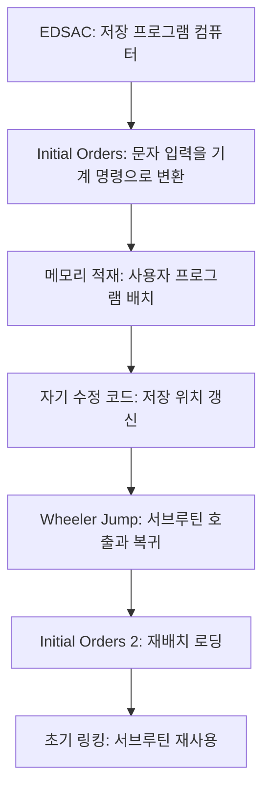

# 해설: EDSAC과 Initial Orders

## 1. 이 글을 읽기 전에 알아야 할 것

이 글의 핵심은 EDSAC이 오래된 컴퓨터였다는 사실 자체가 아니다. 더 중요한 것은 EDSAC 위에서 **프로그램을 읽고, 번역하고, 메모리에 올리고, 실행하는 절차**가 하나의 독립된 소프트웨어 층으로 등장했다는 점이다.

현대 개발자는 소스 파일, 컴파일러, 링커, 로더, 함수 호출, 라이브러리를 당연하게 여긴다. Initial Orders는 이 중 여러 개념이 아직 분리된 이름을 갖기 전, 아주 작은 프로그램 안에 압축되어 있던 사례다.

먼저 다음 구분을 잡고 읽으면 좋다.

| 개념 | 쉬운 설명 | 본문에서의 역할 |
| --- | --- | --- |
| 저장 프로그램 컴퓨터 | 명령과 데이터를 모두 메모리에 저장하는 컴퓨터 | EDSAC의 기본 전제 |
| 로더 | 프로그램을 메모리에 올리는 절차 | Initial Orders의 핵심 기능 |
| 어셈블러 | 사람이 읽는 명령 표기를 기계 명령으로 바꾸는 절차 | `A100S` 같은 표기 변환 |
| 자기 수정 코드 | 프로그램이 자기 명령을 고쳐 쓰는 방식 | 저장 위치 갱신, Wheeler Jump |
| 재배치 | 코드가 놓이는 위치에 맞게 주소를 보정하는 일 | Initial Orders 2의 핵심 |
| 서브루틴 | 반복해서 사용할 수 있는 코드 단위 | Wheeler Jump와 라이브러리의 기반 |

이 글은 컴퓨터사 지식이 없어도 읽을 수 있지만, "명령어도 메모리에 저장된 값"이라는 생각만은 반드시 붙잡아야 한다. 이 전제가 있어야 자기 수정 코드, Wheeler Jump, 재배치 로더가 모두 자연스럽게 연결된다.

---

## 2. 배경 지식: 기초 → 중급 → 심화

### 2.1 기초: 저장 프로그램 컴퓨터

저장 프로그램 컴퓨터는 프로그램 명령을 데이터와 같은 메모리에 저장한다. 이전의 많은 계산 장치는 배선이나 스위치 조작을 통해 계산 절차를 바꾸어야 했다. 저장 프로그램 방식에서는 계산 절차 자체가 메모리 속 값이 되므로, 기계는 메모리에서 명령을 읽고 순서대로 실행할 수 있다.

이 변화의 의미는 크다. 프로그램이 메모리에 들어가면, 다른 프로그램이 그 프로그램을 읽거나 고칠 수 있다. Initial Orders가 종이테이프의 문자 명령을 읽어 메모리에 넣는 것도, Wheeler Jump가 복귀 주소를 명령 안에 써 넣는 것도 이 전제 위에서 가능하다.

### 2.2 기초: 로더와 어셈블러

로더는 프로그램을 실행 가능한 위치에 적재하는 절차다. 현대 운영체제에서는 실행 파일을 메모리에 배치하고 필요한 주소를 맞추는 일이 로더의 역할이다.

어셈블러는 사람이 읽기 쉬운 기호 명령을 기계가 실행할 수 있는 비트 패턴으로 바꾸는 도구다. 예를 들어 `A100S`라는 표기는 사람이 읽기에는 "100번지 short 값을 더하라"에 가깝지만, 기계 내부에서는 opcode와 주소 필드와 길이 비트로 조립되어야 한다.

Initial Orders는 이 둘을 분리된 프로그램으로 갖고 있지 않았다. 작은 초기 명령열 하나가 로더이면서 어셈블러였다.

### 2.3 중급: 자기 수정 코드

자기 수정 코드는 프로그램이 실행 중에 자기 명령어를 바꾸는 방식이다. 현대 프로그래밍에서는 위험하고 피해야 할 기법으로 여겨지는 경우가 많지만, 초기 컴퓨터에서는 메모리와 명령어 체계가 제한적이었기 때문에 매우 실용적인 해결책이었다.

Initial Orders의 `m[25]`에는 다음 위치에 명령을 저장하는 명령이 들어 있다. 처음에는 `T31S`처럼 31번지에 저장하도록 되어 있지만, 한 명령을 저장한 뒤에는 이 명령 자체를 `T32S`, `T33S`처럼 고쳐 다음 위치를 가리키게 한다.

이것은 오늘날의 관점에서 보면 적재 포인터를 갱신하는 일이다. 다만 별도의 포인터 변수와 복잡한 주소 계산 명령 대신, 저장 명령의 주소 필드를 직접 바꾸는 방식으로 구현한 것이다.

### 2.4 중급: Wheeler Jump와 함수 호출

현대 CPU와 언어에는 함수 호출을 위한 명령과 런타임 구조가 있다. 호출 위치를 저장하고, 함수 실행 후 다시 돌아오는 일이 자연스럽게 처리된다.

EDSAC 시기에는 그런 추상화가 아직 없었다. Wheeler Jump는 서브루틴의 첫 부분에 호출한 위치로 돌아갈 수 있는 점프 명령을 만들어 넣는 방식으로 이 문제를 해결했다.

중요한 점은 여기서 함수 호출이 하드웨어의 당연한 기능이 아니라, 소프트웨어 기법으로 먼저 발명되었다는 것이다. 복귀 주소를 명령 안에 써 넣는 발상은 저장 프로그램 컴퓨터의 성질을 적극적으로 이용한 사례다.

### 2.5 심화: 재배치와 링킹

절대주소만 사용하는 프로그램은 특정 메모리 위치에 놓일 때만 제대로 동작한다. 예를 들어 어떤 서브루틴이 내부에서 200번지를 참조하도록 작성되어 있다면, 그 서브루틴을 300번지에 옮겨 놓았을 때 주소가 모두 어긋난다.

재배치는 이 문제를 해결한다. 프로그램 안의 주소를 "현재 적재 기준점으로부터의 상대 위치"로 써 두고, 실제로 메모리에 올릴 때 기준 주소를 더한다.

Initial Orders 2의 `θ`는 바로 이 기준 주소다.

```text
final address = source address + θ
```

이 기능은 현대의 relocatable object file, relocation entry, linker, loader의 조상으로 볼 수 있다. 다만 IO2는 현대 링커처럼 심볼 이름을 해석하거나 외부 참조를 해결하지는 않는다. 순차적으로 붙여 로드하면서 주소를 보정하는 원시적 링킹에 가깝다.

### 2.6 용어 사전

| 용어 | 설명 |
| --- | --- |
| EDSAC | Electronic Delay Storage Automatic Calculator. 케임브리지 대학에서 개발된 초기 저장 프로그램 컴퓨터 |
| Initial Orders | EDSAC의 초기 로더이자 어셈블러 역할을 한 프로그램 |
| Initial Orders 1 | 고정 주소 기반의 초기 적재 시스템 |
| Initial Orders 2 | 재배치 기능을 포함한 확장된 초기 적재 시스템 |
| half-word | EDSAC에서 명령 단위로 쓰이는 17비트 반쪽 word |
| opcode | 명령의 종류를 나타내는 필드 |
| S/L | short/long 길이 지정 비트 |
| accumulator | 산술 연산 결과를 누적하는 레지스터 |
| Wheeler Jump | 서브루틴 호출 후 원래 위치로 돌아가기 위한 초기 기법 |
| θ | IO2에서 현재 서브루틴의 기준 적재 주소 |
| control code | 입력 흐름에서 주소 종료, 재배치, 서브루틴 경계 등을 표시하는 문자 코드 |
| relocation | 코드가 적재된 위치에 맞게 주소를 보정하는 과정 |
| primitive linker | 완전한 심볼 해석은 없지만 여러 코드 조각을 결합하는 초기 링커 형태 |

---

## 3. 숲 보기: 글 전체의 구조와 핵심 통찰

### 3.1 전체 구조

본문은 EDSAC의 하드웨어 설명에서 시작하지만, 실제 중심 주제는 소프트웨어 계층의 탄생이다.



각 부분의 역할은 다음과 같다.

| 부분 | 역할 |
| --- | --- |
| EDSAC 구조 | 명령과 데이터가 메모리에 함께 놓인다는 전제를 마련한다 |
| 명령어 체계 | 사람이 쓰는 표기와 기계 내부 표현의 차이를 보여준다 |
| Initial Orders 1 | 작은 로더와 어셈블러가 프로그램 실행을 가능하게 함을 설명한다 |
| 자기 수정 코드 | 제한된 명령 체계 안에서 상태 갱신을 구현하는 방법을 보여준다 |
| Initial Orders 2 | 주소를 나중에 결정하는 재배치 개념을 설명한다 |
| 현대 비교 | 초기 기법이 로더, 링커, 함수 호출, 라이브러리로 이어짐을 보여준다 |

### 3.2 핵심 통찰

이 글의 핵심 통찰은 다음과 같다.

> 소프트웨어는 기계 명령의 나열에서 시작했지만, 곧바로 "명령을 다루는 명령", "코드를 배치하는 코드", "복귀 주소를 만들어내는 코드"로 발전했다.

Initial Orders가 중요한 이유는 단순히 오래되었기 때문이 아니다. 이것은 프로그램을 실행하기 위해 또 다른 프로그램이 필요하다는 사실, 즉 소프트웨어가 계층 구조로 작동한다는 사실을 선명하게 보여준다.

현대 시스템에서도 같은 구조가 반복된다. 컴파일러가 소스를 번역하고, 링커가 조각을 결합하고, 로더가 메모리에 올리고, 런타임이 함수 호출과 메모리 관리를 돕는다. Initial Orders는 이 분화가 일어나기 전의 압축된 원형이다.

---

## 4. 나무 보기: 섹션별 상세 해설

### 4.1 EDSAC 시스템 구조

EDSAC의 메모리 설명은 단순한 사양 나열이 아니다. 여기서 중요한 것은 명령어가 `half-word` 단위로 저장된다는 점이다. 메모리 단위와 명령어 단위가 밀접하게 연결되어 있기 때문에, Initial Orders는 명령을 어느 half-word에 저장할지 세밀하게 관리해야 했다.

`ABC` accumulator와 `RS` multiplier register 같은 레지스터 설명은 EDSAC이 현대 범용 레지스터 기계와 다르게 매우 제한된 연산 구조를 가졌음을 보여준다. 이런 제한 때문에 간단해 보이는 주소 파싱도 여러 명령과 shift 조작을 통해 이루어진다.

### 4.2 명령어 체계

`A100S` 같은 표기는 오늘날의 어셈블리 언어와 비슷하다. `A`는 연산 종류, `100`은 주소, `S`는 길이 지정이다.

사용자 입장에서는 이것이 문자와 숫자의 조합이지만, 기계 입장에서는 opcode 비트, 주소 비트, 길이 비트가 정해진 위치에 들어간 하나의 명령어다. Initial Orders의 일은 이 두 세계를 연결하는 것이다.

따라서 Initial Orders는 단순한 입력 루틴이 아니다. 문자 기반 표기를 기계 명령으로 바꾸는 번역기다.

### 4.3 Initial Orders 1의 루프

Initial Orders 1의 루프는 다음 단계를 반복한다.

```text
opcode 읽기 → 주소 숫자 읽기 → S/L 읽기 → 명령 조립 → 메모리 저장
```

주소 파싱에서 `address = address * 10 + digit` 방식이 쓰이는 이유는 사용자가 십진수로 주소를 적기 때문이다. 기계 내부는 이진 표현을 쓰지만, 입력 표기는 인간이 다루기 쉬운 십진수다.

이 지점에서 이미 인간 친화적 표현과 기계 친화적 표현 사이의 번역 문제가 등장한다. 현대 프로그래밍 언어와 컴파일러의 근본 문제도 같은 구조다.

### 4.4 `m[25]`와 자기 수정 코드

`m[25]`는 Initial Orders를 이해하는 핵심이다. 이 위치의 명령은 사용자 프로그램을 저장하는 명령이다.

처음에는 31번지에 저장하고, 다음에는 32번지, 그다음에는 33번지에 저장해야 한다. 현대적으로는 `load_ptr++`처럼 표현할 수 있다. 하지만 EDSAC에서는 저장 명령 자체를 고쳐서 이 효과를 낸다.

```text
T31S → T32S → T33S
```

이 방식은 낯설지만, 당시에는 매우 합리적이었다. 별도의 고급 제어 구조 없이도 명령의 주소 필드를 바꾸면 포인터 갱신과 같은 효과를 얻을 수 있기 때문이다.

### 4.5 종료 판정과 사용자 프로그램 실행

Initial Orders는 입력을 계속 읽다가 종료 조건을 만나면 `m[31]`로 제어가 넘어간다. 이 위치부터는 사용자가 적재한 프로그램이 들어 있다.

이는 부트스트랩의 전형적인 구조다.

```text
작은 초기 프로그램 → 사용자 프로그램 적재 → 사용자 프로그램으로 제어 이전
```

현대 시스템에서는 펌웨어가 부트로더를 실행하고, 부트로더가 운영체제를 올리고, 운영체제가 사용자 프로그램을 실행한다. 층은 훨씬 많아졌지만 원리는 같다.

### 4.6 Initial Orders 2와 `θ`

IO2의 핵심 문제는 코드 재사용이다. 고정 주소 코드는 한 위치에서만 동작한다. 서브루틴을 여러 프로그램에서 재사용하려면, 서브루틴이 메모리 어디에 놓이든 내부 주소가 맞아야 한다.

`θ`는 현재 서브루틴이 놓인 시작 주소다. 입력 코드가 상대 주소를 사용하면, IO2는 실제 적재 시점에 `θ`를 더해 절대주소를 만든다.

```text
A 3 θ  + θ=200  → A 203
```

이것은 현대 링커와 로더가 하는 주소 보정의 초기 형태다.

### 4.7 Control Code

IO2에서 `θ`는 현대 언어의 식별자나 심볼 이름이 아니다. 실제로는 입력 테이프에 포함된 특정 제어 문자로 처리된다.

이 차이를 이해해야 한다. IO2는 "이름 있는 심볼을 찾아 주소를 해결하는" 링커가 아니라, 입력 흐름 중 특정 코드가 나오면 기준 주소를 더하는 규칙 기반 로더다.

따라서 IO2는 현대 링커의 모든 기능을 갖춘 시스템은 아니지만, 주소를 적재 시점에 보정한다는 핵심 아이디어를 이미 포함한다.

---

## 5. 본문 밖으로 확장하기

### 5.1 현대 시스템과의 연결

Initial Orders의 기능은 현대 시스템에서는 여러 구성 요소로 분화되어 있다.

| Initial Orders의 기능 | 현대적 대응 |
| --- | --- |
| 종이테이프 읽기 | 파일 입력, 실행 파일 로딩 |
| 문자 명령 해석 | 어셈블러, 컴파일러 프런트엔드 |
| 기계 명령 조립 | 어셈블러, 코드 생성기 |
| 메모리 적재 | 로더, 운영체제 실행 파일 로딩 |
| 주소 보정 | 링커, 동적 로더, relocation |
| 서브루틴 재사용 | 라이브러리, 패키지, 모듈 |

현대 시스템은 더 복잡하지만, "사람이 쓴 표현을 기계가 실행 가능한 형태로 만들고, 적절한 위치에 배치한다"는 기본 문제는 그대로 남아 있다.

### 5.2 현재 기술 흐름에서의 평가

현대에는 자기 수정 코드를 일반 애플리케이션 코드에서 거의 사용하지 않는다. 보안, 캐시 일관성, 디버깅, 최적화 문제를 만들기 때문이다. 그러나 JIT 컴파일러, 동적 코드 생성, 런타임 패치, eBPF, 가상 머신 같은 영역에서는 실행 중 코드 생성과 배치 문제가 여전히 중요하다.

재배치와 링킹도 사라지지 않았다. 정적 링크, 동적 링크, 위치 독립 실행 파일, 공유 라이브러리, 컨테이너 이미지, 패키지 의존성 해결은 모두 "코드 조각을 어디에 놓고 어떻게 연결할 것인가"라는 오래된 문제의 현대적 변형이다.

### 5.3 한계와 비판적 관점

Initial Orders를 현대 도구와 1:1로 대응시키면 과장될 수 있다. IO2는 완전한 링커가 아니며, 심볼 이름 해결이나 외부 참조 관리도 제공하지 않는다. 또한 자기 수정 코드는 오늘날의 유지보수성과 보안 기준에서는 위험한 기법이다.

따라서 정확한 평가는 다음과 같다.

> 본문의 주장: Initial Orders는 로더, 어셈블러, 재배치, 초기 링킹의 원형을 보여준다.  
> 보충 설명: 현대 도구의 완전한 기능을 이미 갖춘 것은 아니다.  
> 현재 관점: 핵심 아이디어는 이어졌지만, 구현 방식은 크게 바뀌었다.

### 5.4 추천 학습 경로

초급 학습자는 먼저 저장 프로그램 컴퓨터, 어셈블리 언어, 함수 호출 구조를 익히는 것이 좋다.

중급 학습자는 object file, relocation, static linking, dynamic linking을 공부하면 Initial Orders 2의 의미가 훨씬 분명해진다.

고급 학습자는 JIT 컴파일러, position-independent code, dynamic loader, ABI, calling convention을 연결해 보면 Wheeler Jump와 IO2가 현대 실행 환경으로 어떻게 확장되었는지 볼 수 있다.

---

## 6. 참고자료 및 추천 학습 경로

### 6.1 역사 자료

- Maurice Wilkes, *Memoirs of a Computer Pioneer*
- Martin Campbell-Kelly, *Programming the EDSAC*
- David Wheeler 관련 EDSAC 서브루틴 자료
- Cambridge EDSAC 역사 자료

### 6.2 현대 시스템 학습

- 컴퓨터 구조: instruction format, register, memory addressing
- 시스템 프로그래밍: assembler, object file, linker, loader
- 운영체제: process loading, virtual memory, dynamic linking
- 컴파일러: code generation, relocation, calling convention

#ComputerHistory #SoftwareEngineering #SystemsProgramming
