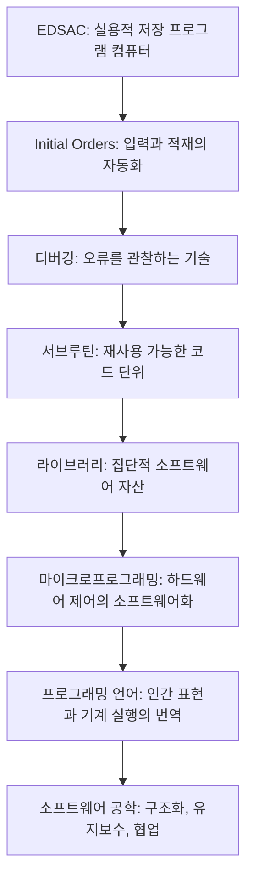

## 1. 이 글을 읽기 전에 알아야 할 것

이 글은 "소프트웨어는 언제 시작되었는가"라는 질문에 단일한 발명품의 이름으로 답하지 않는다. 핵심은 **소프트웨어가 프로그램 코드 하나로 태어난 것이 아니라, 입력, 적재, 번역, 디버깅, 재사용, 모듈화, 언어 설계가 차례로 층을 이루며 생겨났다**는 점이다.

따라서 이 글을 읽을 때는 다음 구분을 먼저 잡아야 한다.

| 구분       | 쉬운 설명                        | 본문에서의 역할                   |
| -------- | ---------------------------- | -------------------------- |
| 하드웨어     | 실제 전기 회로와 기억장치               | EDSAC, 수은 지연선 메모리, 제어부     |
| 프로그램     | 기계가 실행할 명령의 순서               | 종이 테이프에 담긴 명령열             |
| 로더       | 프로그램을 메모리에 적재하는 작은 절차        | Initial Orders             |
| 디버깅      | 프로그램 오류를 찾고 고치는 과정           | 트레이스, 포스트모템, 체크포인트 루틴      |
| 서브루틴     | 재사용 가능한 명령 묶음                | Wheeler Jump와 폐쇄형 서브루틴     |
| 라이브러리    | 검증된 서브루틴의 모음                 | EDSAC 서브루틴 카탈로그            |
| 프로그래밍 언어 | 인간의 개념을 기계 실행 절차로 번역하는 표기 체계 | Fortran, FLOW-MATIC, COBOL |

이 글의 난점은 역사적 사건을 나열하는 데 있지 않다. 더 중요한 것은 각각의 사건이 현대 개발자가 당연하게 여기는 관행, 즉 부트스트랩, 함수 호출, 라이브러리, 디버깅, 컴파일러, 유지보수 문화의 원형으로 어떻게 연결되는지 보는 것이다.

---

## 2. 배경 지식

### 2.1 저장 프로그램 컴퓨터란 무엇인가

초기 계산 기계는 프로그램을 오늘날처럼 메모리에 저장하지 않았다. 어떤 기계는 배선을 바꾸거나 스위치를 조작해야 다른 계산을 수행할 수 있었다. 반면 [[저장 프로그램 컴퓨터]]는 명령 자체를 데이터처럼 메모리에 저장하고, 중앙처리장치가 그 명령을 차례로 읽어 실행한다.

이 변화는 단순한 편의 개선이 아니었다. 프로그램을 메모리에 저장할 수 있게 되면, 프로그램은 기계의 고정된 일부가 아니라 바꿀 수 있고, 저장할 수 있고, 다른 프로그램이 조작할 수 있는 대상이 된다. 이때부터 "프로그램을 다루는 프로그램"이라는 생각이 가능해진다.

본문의 EDSAC은 바로 이 저장 프로그램 방식이 실용적인 계산 서비스로 구현된 중요한 사례다. 케임브리지 대학 컴퓨터 과학 기술부의 설명에 따르면 EDSAC은 1949년 5월 6일 첫 성공적인 프로그램을 실행했고, 실용적 과학 계산 도구로 운영되었다.

### 2.2 소프트웨어적 층위란 무엇인가

본문이 반복해서 강조하는 말은 "층위"다. 이는 소프트웨어가 한 번에 완성된 추상 체계가 아니라, 낮은 수준의 기계 동작 위에 더 높은 수준의 표현을 쌓아 올리는 방식으로 발전했다는 뜻이다.

예를 들어 사용자는 종이 테이프에 기능 문자와 주소를 적는다. 기계는 그것을 그대로 이해하지 못한다. Initial Orders가 먼저 실행되어 테이프를 읽고, 기호를 해석하고, 명령을 메모리에 배치한다. 사용자의 표기와 기계의 실행 사이에 번역 계층이 생긴 것이다.

현대 시스템에서도 같은 구조가 반복된다.

| 초기 EDSAC의 층위   | 현대적 대응물            |
| -------------- | ------------------ |
| Initial Orders | 부트로더, 로더, 어셈블러의 원형 |
| 종이 테이프 입력      | 소스 파일, 바이너리, 패키지   |
| 서브루틴 테이프       | 라이브러리, 패키지, 모듈     |
| 트레이스 루틴        | 로그, 디버거, 실행 추적 도구  |
| 포스트모템 루틴       | 코어 덤프, 크래시 리포트     |
| 마이크로프로그래밍      | 마이크로코드, 명령어 구현 계층  |

따라서 본문은 초기 컴퓨터사를 "기계의 역사"가 아니라 "계층화의 역사"로 읽는다.

### 2.3 소프트웨어는 왜 사회적 기술인가

프로그래밍은 흔히 수학적이고 형식적인 활동으로 이해된다. 하지만 본문은 그보다 넓은 관점을 취한다. 프로그램은 형식 논리인 동시에 사람이 읽고, 고치고, 전승하고, 함께 사용하는 텍스트다.

EDSAC 서브루틴 라이브러리는 이 점을 잘 보여준다. 서브루틴은 단순히 코드를 아끼기 위한 장치가 아니었다. 검증된 절차를 이름 붙여 보관하고, 다른 사용자가 다시 꺼내 쓰게 하는 방식은 프로그래밍을 개인의 숙련에서 공동체의 지식 체계로 바꾸었다.

이 관점에서 보면 [[소프트웨어 공학]]은 1960년대 말 "소프트웨어 위기"와 함께 갑자기 생긴 것이 아니라, 훨씬 이른 시기부터 싹트고 있었다. 오류를 찾는 기술, 재사용 가능한 단위, 라이브러리, 문서화, 언어 설계 원칙은 이미 EDSAC 주변에서 중요한 문제로 떠올랐다.

### 2.4 용어 사전

| 원문 용어                     | 한국어 풀이                                                                      |
| ------------------------- | --------------------------------------------------------------------------- |
| EDSAC                     | Electronic Delay Storage Automatic Calculator. 케임브리지 대학에서 만든 초기 저장 프로그램 컴퓨터 |
| Stored-program computer   | 프로그램과 데이터를 모두 메모리에 저장해 실행하는 컴퓨터                                             |
| Mercury delay line memory | 수은 속을 지나는 음향 펄스의 지연을 이용한 초기 기억장치                                            |
| Initial Orders            | EDSAC의 초기 적재 명령. 종이 테이프 프로그램을 읽어 메모리에 올리는 작은 절차                             |
| Bootstrap                 | 더 작은 절차가 더 큰 절차를 불러와 시스템을 시작하는 구조                                           |
| Debugging                 | 프로그램 오류를 찾아 원인을 확인하고 수정하는 과정                                                |
| Trace routine             | 실행 흐름을 출력해 프로그램 동작을 추적하는 루틴                                                 |
| Post-mortem routine       | 실패 후 메모리 상태를 살펴 원인을 분석하는 루틴                                                 |
| Checkpoint routine        | 실행 중 특정 지점의 상태를 확인하는 루틴                                                     |
| Closed subroutine         | 호출 후 원래 위치로 돌아오는 재사용 가능한 코드 단위                                              |
| Wheeler Jump              | David Wheeler가 고안한 EDSAC의 서브루틴 복귀 기법                                        |
| Library                   | 재사용 가능한 검증된 루틴의 모음                                                          |
| Microprogramming          | CPU 제어 동작을 더 낮은 수준의 프로그램처럼 조직하는 설계 방식                                       |
| Fortran                   | 수식 번역을 목표로 한 초기 고급 프로그래밍 언어                                                 |
| FLOW-MATIC                | Grace Hopper가 주도한 영어식 데이터 처리 언어. COBOL에 큰 영향을 주었다                           |
| Domain-specific language  | 특정 문제 영역의 개념을 직접 표현하도록 설계된 언어                                               |

---

## 3. 글 전체의 구조와 핵심 통찰

### 3.1 전체 구조

본문은 시간순 역사 서술처럼 보이지만, 실제로는 소프트웨어의 핵심 원리가 한 층씩 생겨나는 과정을 따라간다.

각 장의 역할은 다음과 같다.

| 장   | 역할                                      |
| --- | --------------------------------------- |
| 1장  | 소프트웨어를 단일 발명이 아니라 사고방식의 형성으로 정의한다       |
| 2장  | EDSAC의 실용주의적 설계 철학을 제시한다                |
| 3장  | Initial Orders를 통해 부트스트랩과 번역 계층을 설명한다   |
| 4장  | 디버깅을 소프트웨어 개발의 본질적 활동으로 부각한다            |
| 5장  | 서브루틴을 재사용과 모듈화의 출발점으로 해석한다              |
| 6장  | 라이브러리를 통해 개인 기술이 공동체 자산으로 바뀌는 과정을 설명한다  |
| 7장  | 마이크로프로그래밍으로 하드웨어와 소프트웨어의 경계를 다시 본다      |
| 8장  | Fortran, FLOW-MATIC, 언어 설계 철학으로 시야를 넓힌다 |
| 9장  | 현대 소프트웨어의 원리가 초기 컴퓨팅의 제약 속에서 생겨났음을 정리한다 |

### 3.2 핵심 통찰

이 글의 가장 중요한 통찰은 "소프트웨어는 기계를 편하게 쓰기 위한 부속물이 아니라, **인간의 사고를 기계가 실행 가능한 구조로 조직하는 방법**"이라는 점이다.

EDSAC의 사례는 이를 선명하게 보여준다. 하드웨어는 느리고 불안정했지만, 바로 그 제약 때문에 더 읽기 쉬운 표기, 자동 적재 절차, 오류 추적, 재사용 가능한 루틴, 라이브러리, 제어 구조가 필요해졌다. 소프트웨어는 완성된 하드웨어 위에 나중에 얹힌 장식이 아니라, 하드웨어를 실제 문제 해결 도구로 바꾸는 핵심 층이었다.

현대 개발자의 관점에서 보면 이 글은 다음 메시지를 준다.

 >1. 좋은 소프트웨어는 추상화의 층을 잘 나누는 데서 시작된다.
 >2. 디버깅과 관찰 가능성은 부가 기능이 아니라 개발의 본질이다.
 >3. 재사용은 코드 절약이 아니라 신뢰성과 사고 수준을 높이는 방법이다.
 >4. 프로그래밍 언어는 단순한 문법이 아니라 문제를 표현하는 세계관이다.
 >5. 하드웨어와 소프트웨어는 분리된 역사가 아니라 서로를 형성한 역사다.

---

## 4. 장별 상세 해설

### 4.1 서론: 소프트웨어는 언제 시작되었는가

서론의 역할은 "소프트웨어의 시작"이라는 질문을 재정의하는 것이다. 여기서 소프트웨어는 운영체제나 앱 같은 현대적 형태로 한정되지 않는다. "**인간의 의도를 기계가 실행할 수 있는 절차로 바꾸고, 그 절차를 읽기 쉽고 재사용 가능하며 신뢰할 수 있게 만드는 모든 시도**"가 소프트웨어적 사고로 제시된다.

따라서 본문은 EDSAC을 단지 오래된 컴퓨터로 보지 않는다. EDSAC은 부트스트랩, 디버깅, 서브루틴, 라이브러리, 언어 설계 철학이 처음으로 한곳에 모여 선명해진 사례다.

오해하면 안 되는 점은 EDSAC이 "세계 최초의 컴퓨터"라는 단순 주장으로 읽히면 안 된다는 것이다. 본문이 강조하는 것은 우선순위 경쟁이 아니라, **실용적 저장 프로그램 컴퓨터 위에서 프로그래밍이라는 활동이 독립적 문제 영역으로 떠올랐다**는 점이다.

### 4.2 EDSAC의 탄생: 작동하는 기계를 먼저 만들다

2장은 모리스 윌크스의 실용주의를 설명한다. 그는 가장 높은 이론적 성능보다 안정적으로 작동하는 기계를 우선했다. 수은 지연선 메모리와 보수적인 펄스 반복 속도 선택은 이런 판단의 사례다.

이 장의 핵심은 **하드웨어 설계 선택이 소프트웨어의 탄생 조건을 만들었다**는 점이다. 기계가 자주 멈추고 매번 새로 조정해야 한다면, 프로그램의 구조와 재사용, 디버깅은 안정된 실천으로 발전하기 어렵다. 꾸준히 작동하는 기계가 있어야 프로그램을 별도의 대상으로 다룰 수 있다.

현대적으로 말하면 이는 플랫폼 안정성의 문제다. 안정적인 런타임, 운영체제, 빌드 환경이 있어야 그 위에서 라이브러리와 개발 방법론이 축적된다.

### 4.3 Initial Orders와 입력 체계

3장은 소프트웨어적 층위가 처음 등장하는 지점을 설명한다. 사용자가 종이 테이프에 명령을 준비하면, EDSAC은 Initial Orders를 통해 그 명령을 읽고 해석해 메모리에 배치한다.

이 장에서 중요한 개념은 [[부트스트랩]]이다. 복잡한 프로그램을 실행하려면 먼저 더 작은 프로그램이 실행되어야 한다. 이 작은 프로그램은 다시 더 큰 프로그램을 불러오고, 그렇게 시스템이 단계적으로 올라온다.

현대 컴퓨터도 같은 방식을 쓴다. 전원을 켜면 펌웨어가 실행되고, 부트로더가 운영체제를 올리며, 운영체제가 사용자 프로그램과 런타임을 실행한다. EDSAC의 Initial Orders는 이 계층적 시작 절차의 초기 형태로 볼 수 있다.

### 4.4 디버깅의 탄생

4장은 소프트웨어가 하드웨어와 구별되는 독립 문제로 등장하는 순간을 다룬다. 기계가 정상적으로 작동해도 프로그램은 틀릴 수 있다. 오류는 회로 고장이 아니라 사람이 작성한 논리의 결함에서 생긴다.

트레이스 루틴, 포스트모템 루틴, 체크포인트 루틴은 모두 "프로그램의 내부 상태를 관찰 가능하게 만드는 기술"이다. 현대 용어로는 observability, logging, debugging, profiling의 원형이라고 할 수 있다.

이 장의 핵심은 디버깅을 부끄러운 실패 처리로 보지 않는 데 있다. **프로그램 작성은 처음부터 완벽한 명령열을 쓰는 일이 아니라, 실행을 관찰하고 가설을 세우고 수정하는 반복 과정이다.** 이 관점은 테스트 주도 개발, 로그 기반 운영, 장애 분석 문화와 직접 연결된다.

### 4.5 서브루틴의 혁명

5장은 David Wheeler의 폐쇄형 서브루틴과 Wheeler Jump를 설명한다. 오늘날 함수 호출은 당연해 보이지만, 초기 기계에는 호출 주소를 저장하고 복귀하는 편리한 하드웨어 지원이 없었다. Wheeler Jump는 이 문제를 소프트웨어 기법으로 해결했다.

이 장의 의미는 **"반복되는 명령 묶음"을 "이름 붙은 기능 단위"로 바꾸었다**는 데 있다. 이것이 모듈화의 출발점이다. 모듈화는 단순히 코드를 짧게 만드는 기술이 아니라, **프로그램을 사람이 이해할 수 있는 단위로 나누는 사고방식**이다.

현대의 함수, 메서드, 모듈, 패키지, API는 모두 이 원리의 확장이다. 복잡한 시스템은 한 줄씩 이해할 수 없기 때문에, 의미 있는 단위로 나누고 단위 사이의 약속을 정해야 한다.

### 4.6 라이브러리와 프로그래밍 체계

6장은 서브루틴이 개인적 기법을 넘어 집단적 체계가 되는 과정을 다룬다. 검증된 서브루틴을 카탈로그화하고, 반복적으로 필요한 기능을 꺼내 쓰게 하는 방식은 현대 라이브러리 생태계의 원형이다.

여기서 중요한 변화는 세 가지다.

1. 신뢰성: 이미 검증된 코드를 쓰면 오류 가능성이 줄어든다.
2. 생산성: 개발자는 이미 해결된 문제 대신 새로운 문제에 집중한다.
3. 추상화: 저수준 명령열이 아니라 이름 붙은 기능 단위로 생각한다.

이는 오늘날 패키지 매니저, 표준 라이브러리, 오픈소스 의존성 관리의 역사적 뿌리로 읽을 수 있다. 다만 현대와 다른 점도 있다. EDSAC의 라이브러리는 물리적 종이 테이프와 문서 카탈로그에 가까웠고, 버전 관리나 자동 의존성 해결 같은 체계는 없었다.

### 4.7 마이크로프로그래밍

7장은 소프트웨어적 사고가 응용 프로그램을 넘어 하드웨어 제어부 설계로 확장되는 장면이다. 마이크로프로그래밍은 CPU의 명령 실행 과정을 더 작은 제어 단계들의 프로그램처럼 구성한다.

이 발상은 하드웨어와 소프트웨어의 경계를 흐린다. 기계어 명령도 사실은 더 낮은 수준의 제어 절차에 의해 구현될 수 있다. 즉, "실행"이라고 보이던 것이 다른 층위에서는 "해석"일 수 있다.

현대 컴퓨터 구조에서도 이 관점은 중요하다. 명령어 집합 구조, 마이크로코드, 파이프라인, 펌웨어, 가상화는 모두 여러 실행 층위가 겹쳐 있다는 사실을 보여준다.

### 4.8 프로그래밍 언어와 설계 철학의 확장

8장은 EDSAC 이후의 시야를 프로그래밍 언어로 넓힌다. Fortran은 수학적 수식을 기계 실행으로 번역하는 문제를 중심에 놓았고, FLOW-MATIC은 비즈니스 데이터 처리에서 사람이 읽을 수 있는 영어식 표현을 강조했다.

여기서 본문은 프로그래밍 언어를 단순한 문법으로 보지 않는다. 언어는 어떤 종류의 문제를 자연스럽게 표현하게 만들고, 어떤 사고방식을 장려하며, 어떤 협업 방식을 가능하게 한다.

Christopher Strachey와 Niklaus Wirth가 언급되는 이유도 여기에 있다. 큰 프로그램을 만든다는 것은 사실상 그 프로그램 내부에서 사용할 개념 체계와 규칙을 설계하는 일이다. 현대의 프레임워크, DSL, API 설계는 모두 이 문제를 반복한다.

### 4.9 결론: 현대적 원리의 기원

결론은 본문의 모든 축을 다시 모은다. Initial Orders는 부트스트랩과 번역 계층의 원형이고, 디버깅 루틴은 관찰과 수정의 원형이며, 서브루틴과 라이브러리는 재사용과 모듈화의 원형이다. 마이크로프로그래밍은 하드웨어 제어에도 구조적 사고가 적용될 수 있음을 보여준다.

마지막 문장의 핵심은 소프트웨어를 "코드"보다 넓게 보라는 것이다. 

> 소프트웨어는 
> 인간이 자신의 사고를 구조화하고, 
> 그 구조를 기계가 실행 가능한 형식으로 바꾸는 
> 문화적이고 공학적인 실천이다.

---

## 5. 본문 밖으로 확장하기

### 5.1 본문의 주장과 역사적 보충

> 본문의 주장: EDSAC은 초기 소프트웨어적 사고가 선명하게 드러난 장소였다.

보충: 케임브리지 대학 컴퓨터 과학 기술부는 EDSAC이 1949년 5월 6일 첫 성공적 프로그램을 실행했고, 실용적 일반 사용을 위한 저장 프로그램 컴퓨터였다고 설명한다. Whipple Museum도 윌크스가 펜실베이니아 대학 무어 스쿨 강의 이후 폰 노이만 원리에 기반한 실용 컴퓨터를 만들려 했다고 정리한다.

> 본문의 주장: Initial Orders는 부트스트랩, 로더, 초기 번역기의 원형으로 볼 수 있다.

보충: Cambridge의 EDSAC 자료는 Initial Orders가 종이 테이프의 프로그램을 읽어들이고 실행하는 과정을 보여준다. 이는 오늘날의 부트로더와 어셈블러 기능을 아주 기초적 형태로 결합한 사례로 이해할 수 있다.

> 본문의 주장: EDSAC의 서브루틴과 라이브러리는 현대 모듈화와 재사용의 출발점이다.

보충: Computer History Museum은 Wilkes가 EDSAC 프로그래밍을 위해 punched paper tape에 저장된 서브루틴 라이브러리를 만들었다고 설명한다. CMU Libraries는 Wilkes, Wheeler, Gill의 1951년 책을 초기 프로그래밍 문헌의 중요한 사례로 소개한다.

### 5.2 현재 기술 흐름에서의 평가

2026년 기준으로 소프트웨어 개발은 클라우드, 오픈소스 패키지, 컨테이너, CI/CD, AI 코딩 도구, 대규모 언어 모델 기반 개발 보조로 확장되었다. 그러나 본문이 다루는 원리는 여전히 유효하다.

| 초기 원리          | 2026년의 대응                     |
| -------------- | ----------------------------- |
| Initial Orders | 펌웨어, 부트로더, 컨테이너 이미지 초기화       |
| 트레이스·포스트모템     | 로그 수집, 분산 추적, 크래시 덤프, SRE 관측성 |
| 서브루틴           | 함수, 서비스, 컴포넌트, 패키지            |
| 라이브러리          | 오픈소스 생태계, 패키지 레지스트리, 의존성 그래프  |
| 마이크로프로그래밍      | 마이크로코드, 펌웨어 업데이트, ISA 구현      |
| 언어 설계          | DSL, 프레임워크, 타입 시스템, API 디자인   |

AI 코딩 도구가 확산되어도 이 원리는 사라지지 않는다. 오히려 더 중요해진다. AI가 코드를 생성할수록 사람이 해야 할 일은 코드 조각을 무작정 늘리는 것이 아니라, 표현 체계, 모듈 경계, 검증 전략, 관찰 가능성, 책임 소재를 더 분명히 설계하는 것이다.

### 5.3 비판적 관점과 한계

첫째, EDSAC 중심 서술은 소프트웨어의 기원을 매우 선명하게 보여주지만, 다른 계보를 가릴 수 있다. Ada Lovelace의 분석기관 프로그램, ENIAC 프로그래밍, Manchester Baby와 Mark I, UNIVAC과 상업 데이터 처리 흐름도 함께 보아야 한다.

둘째, 초기 소프트웨어사는 종종 남성 연구자 중심으로 서술된다. 그러나 Grace Hopper, Betty Holberton, Jean Bartik 등 초기 프로그래밍과 언어 설계에 기여한 여성들의 역할은 별도로 주목할 필요가 있다.

셋째, "최초"라는 표현은 조심해야 한다. 컴퓨팅 역사에는 실험적 최초, 실용적 최초, 상업적 최초, 이론적 최초가 서로 다르다. 본문은 EDSAC을 절대적 최초로 주장하기보다, 소프트웨어적 원리가 실용적 시스템 위에서 집중적으로 드러난 사례로 읽는 것이 정확하다.

### 5.4 실무적 응용

이 글은 역사 해설이지만, 현대 개발 실무에도 직접적인 교훈을 준다.

| 본문에서 얻는 원리           | 실무 적용                          |
| -------------------- | ------------------------------ |
| 안정적인 기반을 먼저 만든다      | 빌드, 테스트, 배포 환경을 먼저 재현 가능하게 만든다 |
| 입력과 실행 사이에 번역 계층이 있다 | 설정 파일, DSL, API 스키마를 명확히 설계한다  |
| 오류는 정상적인 개발 과정의 일부다  | 로그, 테스트, 디버깅 도구를 초기에 설계한다      |
| 재사용은 신뢰성의 문제다        | 검증된 라이브러리와 내부 공통 모듈을 관리한다      |
| 큰 프로그램은 언어 설계와 비슷하다  | 도메인 개념, 네이밍, 타입, 경계를 일관되게 만든다  |

---

## 6. 참고자료 및 추천 학습 경로

### 6.1 참고자료

- University of Cambridge Department of Computer Science and Technology, [70 years since the first computer designed for practical everyday use](https://www.cst.cam.ac.uk/news/70-years-first-computer-designed-practical-everyday-use)
- Whipple Museum of the History of Science, [The EDSAC and Computing in Cambridge](https://www.whipplemuseum.cam.ac.uk/explore-whipple-collections/calculating-devices/edsac-and-computing-cambridge)
- Cambridge Computer Laboratory, [Edsac](https://www.cl.cam.ac.uk/~mr10/Edsac.html)
- Computer History Museum, [May 6, 1949: British Computer EDSAC Performs First Calculation](https://www.computerhistory.org/tdih/may/6/)
- CMU Libraries, [New to Special Collections: The First Published Book on Computer Programming](https://www.library.cmu.edu/about/news/2022-12/first-computer-programming-book)
- IBM, [Fortran](https://www.ibm.com/history/fortran)
- IBM Research, [The history of Fortran I, II, and III](https://research.ibm.com/publications/the-history-of-fortran-i-ii-and-iii--2)
- Computer History Museum, [Hopper, Grace oral history](https://www.computerhistory.org/collections/catalog/102702026)
- Mark Smotherman, Clemson University, [Microprogramming History](https://people.computing.clemson.edu/~mark/uprog.html)

### 6.2 추천 학습 경로

초급자는 먼저 저장 프로그램 컴퓨터, 함수, 라이브러리, 디버깅의 개념을 익히는 것이 좋다. EDSAC의 세부 명령어보다 "프로그램을 메모리에 저장한다"는 발상이 왜 중요한지 이해하는 것이 우선이다.

중급자는 EDSAC의 Initial Orders, Wheeler Jump, 서브루틴 라이브러리를 현대의 로더, 호출 규약, 표준 라이브러리와 비교해 보라. 이 비교를 통해 추상화와 모듈화가 단순 편의가 아니라 시스템 신뢰성의 조건임을 이해할 수 있다.

고급자는 마이크로프로그래밍, 컴파일러, 프로그래밍 언어 설계, 소프트웨어 아키텍처를 함께 읽는 것이 좋다. 특히 "큰 프로그램을 작성한다는 것은 하나의 언어를 설계하는 일"이라는 관점은 DSL, 프레임워크, 플랫폼 엔지니어링을 이해하는 데 중요하다.

---

## 7. 복습 질문

1. EDSAC이 소프트웨어 역사에서 중요한 이유는 단순히 "초기 컴퓨터"였기 때문인가, 아니면 다른 이유가 있는가?
2. Initial Orders는 현대 컴퓨터의 어떤 구성 요소들과 비교할 수 있는가?
3. 디버깅이 소프트웨어 개발의 본질적 활동이라는 말은 무슨 뜻인가?
4. Wheeler Jump는 왜 함수 호출과 모듈화의 역사에서 중요한가?
5. EDSAC의 서브루틴 라이브러리는 오늘날 오픈소스 패키지 생태계와 어떤 점에서 닮았고, 어떤 점에서 다른가?
6. 마이크로프로그래밍은 하드웨어와 소프트웨어의 경계를 어떻게 다시 생각하게 하는가?
7. Fortran과 FLOW-MATIC은 각각 어떤 종류의 인간 표현을 기계 실행으로 번역하려 했는가?
8. AI 코딩 도구 시대에도 초기 소프트웨어사의 원리가 여전히 중요한 이유는 무엇인가?

---

#ComputerHistory #SoftwareEngineering #ProgrammingLanguages #EDSAC #CS
