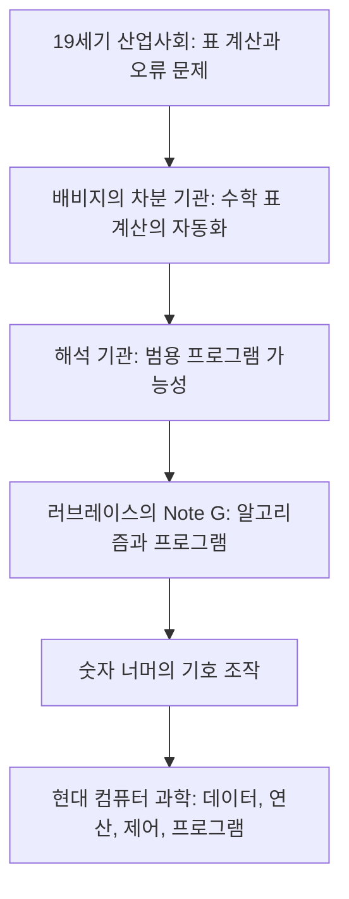

## 1. 이 글을 읽기 전에 알아야 할 것

이 글은 컴퓨터의 기원을 전자식 컴퓨터가 등장한 20세기가 아니라, 19세기 기계식 계산 장치의 상상력에서 찾는다. 핵심 인물은 [[찰스 배비지]]와 [[에이다 러브레이스]]다.

배비지는 계산을 인간의 손노동에서 분리해 기계가 수행하도록 만들고자 했다. 러브레이스는 그 기계가 단순한 숫자 계산기를 넘어 기호와 패턴을 다룰 수 있다는 의미를 읽어냈다.

읽기 전에 다음 구분을 잡아두면 좋다.

| 구분 | 핵심 의미 | 본문에서의 역할 |
|---|---|---|
| 계산 | 사람이 수식을 풀거나 표를 만드는 행위 | 오류가 생기는 인간 노동 |
| 연산 | 규칙에 따라 기계가 단계적으로 수행하는 절차 | 컴퓨팅의 출발점 |
| 차분 기관 | 다항식 표 계산을 자동화하는 특수 목적 기계 | 수학 표 제작의 자동화 |
| 해석 기관 | 프로그램에 따라 여러 작업을 수행할 수 있는 범용 기계 설계 | 현대 컴퓨터 구조의 전조 |
| 알고리즘 | 문제를 기계가 실행 가능한 단계로 나눈 절차 | 러브레이스의 핵심 기여 |
| 프로그램 | 알고리즘을 기계가 읽고 실행할 수 있게 표현한 것 | 천공 카드와 Note G |
| 기호 조작 | 숫자를 수량이 아니라 의미를 담는 기호로 다루는 관점 | 음악, 도형, 논리 처리 가능성 |

이 글의 중요한 포인트는 "실제로 완성되었는가"보다 "어떤 개념을 처음 분명하게 상상했는가"다. 배비지의 해석 기관은 완성되지 않았지만, 연산 장치와 저장 장치, 조건 분기, 반복, 프로그램 입력 같은 핵심 구조를 설계했다. 러브레이스는 그 구조가 단순 계산을 넘어 일반적인 기호 처리로 확장될 수 있음을 보았다.

---

## 2. 배경 지식

### 2.1 왜 수학 표가 중요했는가

19세기에는 항해, 천문학, 공학, 보험, 회계 등 여러 분야에서 수학 표가 필수였다. 지금처럼 계산기나 컴퓨터가 없었기 때문에 많은 계산은 사람이 직접 수행했고, 인쇄된 표로 배포되었다. 문제는 사람이 계산하고 옮겨 적고 인쇄하는 과정에서 오류가 자주 발생했다는 점이다.

배비지가 해결하려 한 문제는 단순히 "계산을 빠르게 하자"가 아니었다. 그는 계산과 인쇄 과정 전체에서 인간 오류를 제거하려 했다. 이 문제의식이 차분 기관으로 이어졌다.

### 2.2 유한 차분법이 왜 기계화에 적합한가

차분 기관의 수학적 핵심은 [[유한 차분법]]이다. 어떤 다항식의 값들을 차례로 나열하면, 일정 단계의 차분이 상수가 된다. 예를 들어 $x^2$의 값은 1, 4, 9, 16, 25처럼 증가하고, 1차 차분은 3, 5, 7, 9가 되며, 2차 차분은 2로 일정하다.

이 원리는 중요하다. 복잡해 보이는 곱셈이나 거듭제곱 계산을 **덧셈의 반복**으로 바꿀 수 있기 때문이다. 톱니바퀴로 이루어진 기계는 복잡한 대수 조작보다 반복적인 덧셈을 구현하기 쉽다. 차분 기관은 바로 이 점을 이용한 특수 목적 자동 계산 장치다.

### 2.3 해석 기관은 왜 더 급진적인가

차분 기관이 특정 종류의 수학 표를 계산하는 기계라면, 해석 기관은 명령에 따라 여러 문제를 처리할 수 있는 범용 기계였다. 이 차이는 계산기와 컴퓨터의 차이에 가깝다.

해석 기관의 핵심은 다음 구조에 있다.

| 해석 기관           | 현대적 대응        |
| --------------- | ------------- |
| Mill            | 중앙처리장치, 연산 장치 |
| Store           | 메모리           |
| 연산 카드           | 명령어           |
| 변수 카드           | 데이터와 저장 위치    |
| Jacquard식 천공 카드 | 프로그램 입력 매체    |
| 반복과 조건 분기       | 제어 흐름         |

이 구조는 나중의 전자식 컴퓨터와 물리적으로는 다르지만, 논리적으로는 매우 현대적이다. 특히 연산과 저장의 분리, 프로그램에 따른 동작 변경, 조건과 반복의 사용은 컴퓨터가 단순 계산기를 넘어 범용 절차 실행 장치가 되는 조건이다.

### 2.4 러브레이스의 통찰은 무엇이었나

러브레이스는 배비지의 해석 기관을 단순한 계산 장치로만 보지 않았다. 그녀는 **숫자가 수량만이 아니라 관계와 기호를 표현할 수 있다면, 기계도 규칙이 정의된 기호 체계를 다룰 수 있다**고 보았다.

이 생각은 매우 중요하다. 현대 컴퓨터는 숫자만 계산하지 않는다. 텍스트, 이미지, 음악, 영상, 그래프, 신경망 가중치까지 모두 비트 패턴으로 표현하고 조작한다. 러브레이스의 통찰은 바로 이 일반적 정보 처리 관점의 초기 형태로 읽을 수 있다.

다만 주의할 점도 있다. 러브레이스가 현대적 의미의 소프트웨어 산업이나 인공지능을 직접 예견했다고 과장해서는 안 된다. 그녀가 한 일은 **해석 기관의 가능성을 수학적 계산 너머의 기호 조작으로 확장해 해석**한 것이다. 이 차이를 분명히 해야 역사적 의미가 더 정확해진다.

### 2.5 용어 사전

| 용어 | 설명 |
|---|---|
| Charles Babbage | 차분 기관과 해석 기관을 설계한 영국 수학자·발명가 |
| Ada Lovelace | 해석 기관의 의미를 해석하고 Note G를 남긴 수학자 |
| Difference Engine | 다항식 표 계산과 인쇄를 자동화하려 한 특수 목적 기계 |
| Analytical Engine | 프로그램 가능한 범용 기계로 설계된 배비지의 미완성 장치 |
| Method of Finite Differences | 다항식 값을 차분의 반복으로 계산하는 방법 |
| Mill | 해석 기관의 연산부 |
| Store | 해석 기관의 저장부 |
| Jacquard loom | 천공 카드로 무늬를 제어하던 직기. 해석 기관 입력 방식의 영감 |
| Note G | 러브레이스의 주석 중 베르누이 수 계산 절차가 담긴 부분 |
| Bernoulli numbers | 수학의 여러 영역에서 등장하는 수열. Note G의 계산 대상 |
| Algorithm | 문제 해결 절차를 명확한 단계로 표현한 것 |
| Conditional branching | 조건에 따라 다음 실행 경로를 바꾸는 제어 구조 |
| Loop | 특정 절차를 반복 실행하는 제어 구조 |
| Lovelace objection | 기계는 스스로 창조하지 못하고 인간이 지시한 것만 수행한다는 논점 |
| Babbage principle | 숙련 노동을 세분화해 비용을 낮추는 분업 원리 |

---

## 3. 숲 보기: 글 전체의 구조와 핵심 통찰

### 3.1 전체 구조

본문은 기계의 역사에서 시작해 알고리즘적 사고의 철학으로 이동한다.

각 부분의 역할은 다음과 같다.

| 부분 | 역할 |
|---|---|
| 도입 | 오래된 기계를 현재의 컴퓨팅 문명과 연결한다 |
| 전컴퓨팅 시대 | 배비지와 러브레이스가 등장한 산업사회 배경을 제시한다 |
| 차분 기관 | 계산 자동화와 오류 제거라는 문제의식을 설명한다 |
| 해석 기관 | 범용 컴퓨터의 논리적 구조를 보여준다 |
| 러브레이스 | 알고리즘, 변수, 실행 순서, 기호 조작 가능성을 설명한다 |
| 철학적 유산 | 컴퓨터를 정보 처리 매체로 보는 관점을 제시한다 |
| 결론 | 알고리즘적 사고가 현대 프로그래밍과 AI의 기반임을 정리한다 |

### 3.2 핵심 통찰

이 글의 핵심은 "**컴퓨팅은 전자 기술보다 먼저 개념으로 태어났다**"는 것이다. 배비지의 기계는 증기와 톱니바퀴의 시대에 속했지만, 그 안에는 현대 컴퓨터 과학의 중요한 구조가 들어 있었다.

가장 중요한 통찰은 세 가지다.

1. **계산은 기계화될 수 있다** : 복잡한 수학 작업도 반복 가능한 절차로 바꾸면 기계가 수행할 수 있다.
2. **기계는 프로그램 가능해질 수 있다** : 고정된 계산만 하는 장치가 아니라, 명령에 따라 다른 일을 수행하는 범용 장치를 상상할 수 있다.
3. **컴퓨팅은 숫자 계산을 넘어 기호 조작이 될 수 있다** : 음악, 도형, 언어, 논리도 규칙으로 표현되면 처리 대상이 된다.

이 세 가지가 합쳐지면 현대적 의미의 컴퓨터가 보인다. 컴퓨터는 빠른 계산기가 아니라, 형식화된 절차를 실행하는 범용 기호 처리 장치다.

---

## 4. 나무 보기: 섹션별 상세 해설

### 4.1 왜 우리는 '컴퓨팅 공룡'을 기억해야 하는가

도입부의 "컴퓨팅 공룡" 비유는 오래된 기계를 단순한 유물이 아니라 현재를 이해하는 기준점으로 보게 만든다. 공룡 화석이 생명의 진화를 이해하게 하듯, 차분 기관과 해석 기관은 컴퓨팅 개념의 진화를 보여준다.

여기서 중요한 표현은 "실리콘 화석"이다. 배비지의 기계는 실리콘으로 만들어지지 않았지만, 오늘날 실리콘 기반 컴퓨터가 수행하는 추상적 원리를 먼저 담고 있었다는 뜻이다.

### 4.2 두 천재의 만남: 배비지와 러브레이스

이 섹션은 배비지와 러브레이스의 역할을 대비시킨다. 
배비지는 계산 오류를 제거하기 위한 기계적 구조를 설계했고, 
러브레이스는 그 구조가 무엇을 의미하는지 해석했다.

배비지의 출발점은 정확성이다. 당시 수학 표는 항해와 천문학에 필수였고, 오류는 실제 위험으로 이어질 수 있었다. 따라서 차분 기관은 지적 장난감이 아니라 사회적·산업적 필요에서 나온 자동화 프로젝트였다.

러브레이스의 역할은 단순한 조력자로 축소하면 안 된다. 그녀는 배비지의 기계가 가진 추상적 가능성을 언어화했다. 특히 "기계가 대수적 문양을 짠다"는 비유는 컴퓨팅을 패턴 처리로 보는 중요한 해석이다.

### 4.3 차분 기관: 수학의 기계화

차분 기관은 특수 목적 기계다. 이 말은 가치가 낮다는 뜻이 아니다. 오히려 특정 문제를 깊이 이해해 기계적으로 처리 가능한 형태로 바꾸었다는 점에서 중요하다.

유한 차분법의 핵심은 어려운 계산을 반복 덧셈으로 바꾸는 것이다. 이는 알고리즘 설계의 일반 원리와 닮았다. 좋은 알고리즘은 문제를 기계가 잘 처리할 수 있는 더 단순한 조작으로 재구성한다.

1991년에 Science Museum이 배비지의 설계에 따라 Difference Engine No. 2의 계산부를 완성했고, 2002년에 인쇄 장치를 추가했다는 사실은 중요하다. 이는 배비지의 설계가 단순한 공상이 아니라 실제로 작동 가능한 설계였음을 보여준다. 다만 배비지가 생전에 그 기계를 완성하지 못한 이유는 기술적 불가능성만이 아니라 비용, 제작 정밀도, 관리, 협업, 설계 변경 같은 복합적 조건이었다.

### 4.4 해석 기관: 범용성의 탄생

해석 기관은 본문에서 가장 중요한 개념적 전환점이다. 차분 기관은 특정한 수학 표를 만드는 장치였지만, 해석 기관은 프로그램을 바꾸면 다른 작업을 수행할 수 있는 범용 기계를 지향했다.

Mill과 Store의 구분은 연산과 저장의 분리다. 조건 분기와 루프는 실행 흐름을 데이터나 조건에 따라 바꾸는 능력이다. 천공 카드는 명령을 기계 밖에서 준비해 입력하는 프로그램 매체다.

오늘날의 컴퓨터와 비교할 때 물리적 구현은 완전히 다르지만, 논리 구조는 놀랍게 닮아 있다. 그래서 해석 기관은 "전자식 컴퓨터의 직접 조상"이라기보다 "범용 컴퓨터 개념의 선명한 예고"라고 보는 것이 정확하다.

### 4.5 러브레이스: 알고리즘과 최초의 프로그램

러브레이스의 Note G는 베르누이 수를 계산하기 위한 단계적 절차를 담고 있다. 이 절차는 변수, 중간값, 연산 순서, 반복 구조를 포함한다. 그래서 많은 해설에서 세계 최초의 컴퓨터 프로그램 또는 알고리즘으로 설명된다.

다만 이 표현에는 주의가 필요하다. 해석 기관이 실제로 완성되어 Note G를 실행한 것은 아니며, 배비지도 해석 기관용 절차를 작성했다. 최근 연구는 배비지와 러브레이스의 공동 작업 성격을 더 강조한다. 그럼에도 러브레이스의 독자적 의의는 줄어들지 않는다. 그녀는 절차를 표 형태로 정리했을 뿐 아니라, 그 절차가 갖는 일반적 의미를 깊이 해석했다.

본문의 "원소적 연산으로의 분해", "변수 매핑", "순차적 실행"은 프로그래밍의 기본 훈련과 그대로 연결된다. 프로그래밍은 큰 문제를 작은 조작으로 나누고, 데이터를 이름 붙여 저장하며, 실행 순서를 명확히 지정하는 작업이다.

### 4.6 기계는 숫자 이상을 다룰 수 있다

이 섹션은 러브레이스의 가장 현대적인 통찰을 다룬다. 숫자는 수량을 나타낼 수도 있지만, 기호나 관계를 나타낼 수도 있다. 그렇다면 숫자를 조작하는 기계는 실제로는 기호 체계를 조작하는 기계가 될 수 있다.

이 관점은 현대 컴퓨터의 핵심이다. 컴퓨터 안에서 문자는 문자 코드로, 이미지는 픽셀 배열로, 음악은 샘플과 주파수 정보로, 인공지능 모델은 행렬과 확률 분포로 표현된다. 표면적으로는 서로 다른 대상이지만, 내부적으로는 모두 형식화된 데이터다.

### 4.7 기계는 생각하는가

러브레이스의 "기계는 우리가 명령한 것 이상을 할 수 없다"는 취지의 주장은 훗날 앨런 튜링이 논의한 Lovelace objection과 연결된다. 이 논점은 오늘날 AI 논쟁에서도 반복된다.

중요한 것은 이 문장을 단순히 "기계는 창의적일 수 없다"로만 읽지 않는 것이다. 러브레이스는 기계의 한계를 말하면서도, 명령과 규칙이 충분히 정교하게 구성될 때 기계가 다룰 수 있는 표현 영역이 크게 넓어진다는 점도 보았다.

현대 AI의 관점에서 보면 질문은 이렇게 바뀐다. "기계가 명령받은 것 이상을 하는가"보다 "학습된 규칙과 데이터에서 나온 결과를 우리는 어떻게 이해하고 책임질 것인가"가 더 중요해진다.

### 4.8 산업사회와 알고리즘적 사고

본문은 배비지의 계산 기계와 산업사회의 분업 논리를 연결한다. 배비지는 제조업에서 노동을 세분화해 효율을 높이는 문제에도 관심을 가졌다. 계산을 작은 연산 단계로 분해하는 사고와 노동을 작은 작업 단위로 분해하는 사고는 구조적으로 닮아 있다.

이 대목은 컴퓨팅을 순수한 수학사로만 보지 않게 한다. 컴퓨팅은 산업사회, 행정, 표준화, 노동 조직, 비용 계산의 역사와 함께 발전했다. 알고리즘적 사고는 추상 수학의 산물이면서 동시에 산업적 조직화의 산물이다.

### 4.9 증기에서 실리콘으로, 그리고 미래로

결론부는 19세기의 증기, 20세기의 전자, 21세기의 알고리즘을 하나의 흐름으로 묶는다. 표현은 문학적이지만 핵심은 분명하다. 컴퓨팅의 본질은 물질이 아니라 구조다.

기계가 톱니바퀴로 움직이든, 전자로 움직이든, 클라우드 데이터센터에서 실행되든, 
핵심 질문은 같다. 문제를 단계로 분해했는가, 데이터를 저장하고 참조할 수 있는가, 반복과 조건을 구조화했는가, 명령을 바꾸면 다른 일을 할 수 있는가.

---

## 5. 본문 밖으로 확장하기

### 5.1 본문의 주장과 역사적 보충

> 본문의 주장: 차분 기관은 수학 표 계산의 오류를 제거하려는 자동화 프로젝트였다.

보충: Science Museum은 Difference Engine No. 2가 방정식의 값을 계산하고 그 결과를 수학 표 형태로 인쇄하기 위해 설계되었다고 설명한다. 또한 1991년에 계산부가 완성되고 2002년에 인쇄 장치가 추가되었다고 정리한다.

> 본문의 주장: 해석 기관은 범용 컴퓨터의 논리적 구조를 예견했다.

보충: 배비지의 해석 기관은 Mill과 Store, 천공 카드 입력, 조건 분기와 반복을 포함한 설계로 설명된다. 이는 현대 컴퓨터와 동일한 물리적 계보라기보다, 범용 프로그램 가능성의 개념적 선구로 이해하는 편이 정확하다.

> 본문의 주장: 러브레이스는 숫자 계산을 넘어 기호 조작 가능성을 보았다.

보충: 러브레이스의 Menabrea 논문 번역 주석은 해석 기관이 '수량뿐 아니라 일반적 관계를 다룰 수 있다'는 점을 강조한 것으로 자주 해석된다. 특히 Note G는 베르누이 수 계산 절차 때문에 초기 컴퓨터 프로그램 논의의 중심 자료가 되었다.

### 5.2 "최초"를 말할 때의 주의점

컴퓨터 역사에서 "최초"라는 말은 조심해야 한다. 
기준에 따라 답이 달라지기 때문이다.

| 질문              | 가능한 기준                                                 |
| --------------- | ------------------------------------------------------ |
| 최초의 컴퓨터는 무엇인가   | 기계식, 전자식, 범용, 저장 프로그램, 실제 작동 여부에 따라 달라진다               |
| 최초의 프로그램은 무엇인가  | 실행된 프로그램인지, 설계된 절차인지, 출판된 알고리즘인지에 따라 달라진다              |
| 최초의 프로그래머는 누구인가 | 배비지의 절차 작성과 러브레이스의 Note G 해석을 어떻게 평가하느냐에 따라 달라진다       |
| 최초의 디버깅은 무엇인가   | 수식 오류 수정, 실제 기계 오류 추적, 프로그램 결함 수정 중 무엇을 볼 것인지에 따라 달라진다 |

따라서 러브레이스를 "최초의 프로그래머"라고 부르는 표현은 상징적으로는 유효하지만, 학술적으로는 배비지와의 협업, 해석 기관의 미완성, Note G의 성격을 함께 설명해야 정확하다.

### 5.3 현재 기술 흐름에서의 평가

2026년의 컴퓨팅은 클라우드, 모바일, 대규모 언어 모델, AI 에이전트, GPU 가속, 양자 컴퓨팅 연구까지 확장되어 있다. 하지만 배비지와 러브레이스가 제기한 핵심 질문은 여전히 살아 있다.

| 19세기 질문                   | 2026년의 대응                     |
| ------------------------- | ----------------------------- |
| 계산을 자동화할 수 있는가            | 워크플로 자동화, 데이터 파이프라인, AI 자동 코딩 |
| 명령을 바꾸면 다른 일을 하게 할 수 있는가  | 범용 프로그래밍 언어, 가상머신, 클라우드 함수    |
| 데이터를 어디에 저장하고 어떻게 참조할 것인가 | 메모리 계층, 데이터베이스, 벡터 저장소        |
| 반복과 조건을 어떻게 구조화할 것인가      | 제어 흐름, 워크플로 엔진, 에이전트 플래닝      |
| 기계가 숫자 이상을 다룰 수 있는가       | 멀티모달 AI, 이미지·음성·텍스트 처리        |
| 기계가 창의적인가                 | 생성형 AI, 평가, 책임, 저작권 논쟁        |

AI 시대에도 기본은 같다. 모델이 아무리 복잡해져도, 입력을 표현하고, 상태를 저장하고, 절차를 실행하고, 결과를 해석하는 구조는 여전히 컴퓨팅의 핵심이다.

### 5.4 실무적 응용

이 글은 역사 해설이지만 프로그래밍 실무에도 직접 연결된다.

| 본문에서 얻는 원리        | 실무 적용                                |
| ----------------- | ------------------------------------ |
| 문제를 더 작은 연산으로 나눈다 | 복잡한 기능을 작은 함수와 테스트 가능한 단위로 분해한다      |
| 데이터와 연산을 구분한다     | 모델, 상태, 서비스 로직의 책임을 분리한다             |
| 반복과 조건을 명확히 한다    | 제어 흐름을 읽기 쉽게 설계하고 예외 경로를 드러낸다        |
| 기계가 읽을 표현을 만든다    | API, 스키마, 설정 파일, DSL을 명확히 정의한다       |
| 숫자 너머의 기호를 다룬다    | 텍스트, 이미지, 이벤트, 그래프를 일관된 데이터 구조로 표현한다 |
| 자동화는 오류 제거와 연결된다  | 수동 작업을 줄이고 재현 가능한 파이프라인을 만든다         |

---

## 6. 참고자료 및 추천 학습 경로

### 6.1 참고자료

- Science Museum, [Charles Babbage’s Difference Engines and the Science Museum](https://www.sciencemuseum.org.uk/objects-and-stories/charles-babbages-difference-engines-and-science-museum)
- Science Museum Group Collection, [Babbage's Difference Engine No 2, 2002](https://collection.sciencemuseumgroup.org.uk/objects/co62748/babbages-difference-engine-no-2-2002)
- Computer History Museum, [A Modern Sequel](https://www.computerhistory.org/babbage/modernsequel)
- Computer History Museum, [The Computer History Museum Debuts Charles Babbage's Difference Engine No. 2](https://computerhistory.org/press-releases/babbage-engine-exhibit/)
- Britannica, [Difference Engine No. 2](https://www.britannica.com/science/Difference-Engine-No-2)
- arXiv, [Charles Babbage, Ada Lovelace, and the Bernoulli Numbers](https://arxiv.org/abs/2301.02919)
- arXiv, [How Charles Babbage invented the Computer](https://arxiv.org/abs/2311.04371)
- arXiv, [The First Computer Program](https://arxiv.org/abs/2303.13740)

### 6.2 추천 학습 경로

초급자는 차분 기관과 해석 기관의 차이를 먼저 이해하는 것이 좋다. 차분 기관은 특정 계산을 자동화하는 기계이고, 해석 기관은 프로그램에 따라 다른 일을 수행할 수 있는 범용 기계라는 점을 잡으면 된다.

중급자는 유한 차분법, Mill/Store 구조, 천공 카드, 루프와 조건 분기를 현대 컴퓨터 구조와 비교해 보라. 이 비교를 통해 19세기 기계식 설계가 왜 현대적 의미를 갖는지 이해할 수 있다.

고급자는 러브레이스의 Note G를 둘러싼 해석 논쟁을 살펴보는 것이 좋다. "최초의 프로그래머"라는 상징적 평가와, 배비지·러브레이스의 공동 작업을 강조하는 최근 연구 사이의 균형을 잡는 것이 중요하다.

---

## 7. 복습 질문

1. 배비지가 해결하려 한 문제는 단순히 계산 속도였는가, 아니면 다른 문제가 있었는가?
2. 유한 차분법은 왜 기계식 계산 장치에 적합한 방법이었는가?
3. 차분 기관과 해석 기관의 차이는 왜 계산기와 컴퓨터의 차이로 볼 수 있는가?
4. 해석 기관의 Mill과 Store는 현대 컴퓨터의 어떤 구성 요소와 대응되는가?
5. 러브레이스의 Note G는 왜 알고리즘 또는 프로그램의 초기 사례로 평가되는가?
6. 러브레이스가 숫자를 기호로 보았다는 말은 무슨 뜻인가?
7. "기계는 우리가 명령한 것 이상을 할 수 없다"는 주장은 현대 AI 논쟁에서 어떻게 다시 등장하는가?
8. 컴퓨터 역사에서 "최초"라는 표현을 조심해야 하는 이유는 무엇인가?

---

#ComputerHistory #Babbage #AdaLovelace #Algorithms #Computing
