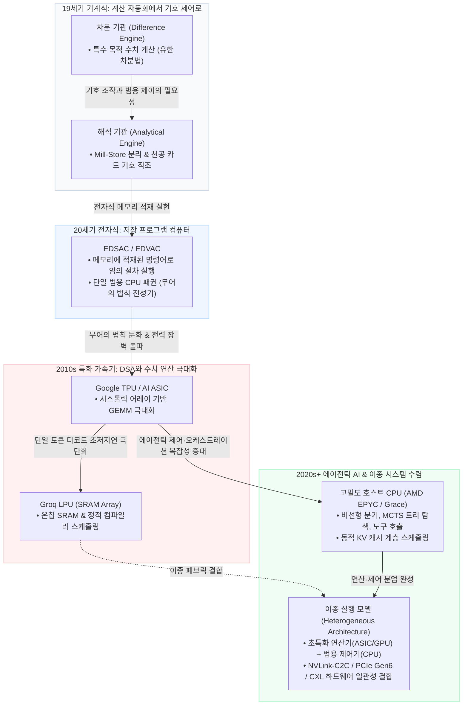

## 핵심 질문

인공지능 하드웨어의 발전은 특수 목적 가속기(ASIC/TPU)가 범용 프로세서(CPU)를 완전히 대체하는 단선적 과정인가? 결론부터 말하면, 컴퓨터 아키텍처의 역사는 **"특화된 수치 연산기(Calculative Specialization)"**와 **"범용 기호 제어기(Control Generalization)"** 사이를 주기적으로 왕복하는 **진자 운동(Pendulum)**에 가깝다.

19세기 [[차분 기관]]과 [[해석 기관]]의 대립, 20세기 중반 고정 배선 회로와 [[저장 프로그램 개념의 여러 기원|저장 프로그램 컴퓨터]]의 도약, 2010년대 [[도메인 특화 가속기|도메인 특화 아키텍처(DSA)]]의 폭발적 성장, 그리고 최근 **에이전틱 AI(Agentic AI)**의 대두와 함께 일어난 **CPU의 재부각**은 모두 동일한 아키텍처적 인과율 위에서 전개된다.

![[diagram_specialized_vs_general_pendulum.svg|특화 연산기와 범용 제어기의 200년 진자 운동 및 이종 컴퓨팅 수렴 계보도]]



---

## 1. 특화의 물결: 차분 기관에서 TPU·LPU까지

### 시스톨릭 어레이와 결정론적 실행
[[In-Datacenter Performance Analysis of a Tensor Processing Unit|Google 1세대 TPU]]와 후속 가속기들은 찰스 배비지가 다항식 표 계산을 위해 톱니바퀴의 맞물림을 고정했던 원리를 실리콘 위에 재현했다. 심층 신경망의 핵심 연산인 대규모 행렬 곱셈(GEMM)은 데이터의 재사용률이 극히 높다. 

- **시스톨릭 어레이(Systolic Array)**: 데이터를 레지스터 파일에서 매번 읽어오는 대신, 격자 형태의 곱셈-누산기(MAC) 배열 사이로 파도처럼 흘려보내며 연산한다.
- **제어 오버헤드 제거**: [[A New Golden Age for Computer Architecture|Hennessy와 Patterson이 지적]]했듯, 범용 CPU가 명령어 디코딩, 분기 예측, 비순차 실행(Out-of-Order), 다단계 캐시 일관성에 소비하던 전력과 다이(Die) 면적을 제거함으로써 순수 연산 밀도(TOPS/W)를 수십 배 향상시켰다.
- **정적 컴파일러 스케줄링(Groq LPU)**: 동적 하드웨어 스케줄러를 완전히 배제하고 컴파일러가 클록 사이클 단위로 데이터 이동을 결정하는 초특화 구조는 추론 지연 시간의 지터(Jitter)를 0으로 수렴시켰다.

### 특화가 치르는 세 가지 비용
그러나 특수화는 언제나 다음의 비용을 청구한다:
1. **알고리즘 고착화(Algorithm Brittleness)**: 밀집 행렬(Dense GEMM)에 맞춰진 시스톨릭 어레이는 희소 어텐션(Sparse Attention), 상태 공간 모델(SSM/Mamba), 혼합 전문가(MoE)처럼 비정형적이고 불규칙한 메모리 접근을 요구하는 새 아키텍처에서 하드웨어 활용률(MFU)이 급락한다.
2. **[[Hitting the Memory Wall|메모리 장벽]]과 면적 한계**: 초고속 SRAM에 의존하는 가속기는 수백 GB에 달하는 거대 모델 가중치를 담기 위해 천문학적인 칩 개수와 랙 스케일 상호연결을 요구한다.
3. **[[Reevaluating Amdahl's Law|암달의 법칙]]의 복수**: 행렬 연산 구간을 아무리 가속해도, 가속되지 않는 데이터 전처리, 토큰 샘플링, 제어 흐름 분기가 전체 파이프라인의 병목으로 부상한다.

---

## 2. 병렬 범용성의 진화: GPU와 프로그래밍 모델

GPU는 특수 목적 래스터화 파이프라인(3D 그래픽 계산기)으로 출발했으나, [[Scalable Parallel Programming with CUDA|CUDA]]와 프로그래머블 셰이더를 통해 **대규모 병렬 범용 컴퓨터(SIMT)**로 변모했다.

| 비교 축 | 전용 AI ASIC (TPU / LPU) | 프로그래머블 GPU (Hopper / Blackwell) | 범용 프로세서 (서버 CPU) |
|---|---|---|---|
| **실행 모델** | 고정 데이터플로우 / 시스톨릭 | 대규모 SIMT (Warp 기반 스케줄링) | SISD / MIMD (비순차 파이프라인) |
| **명령어 유연성** | 매우 낮음 (고정 ISA / 텐서 매크로) | 중간~높음 (C++ 기반 임의 커널 컴파일) | 극대 (임의의 튜링 완전 프로그램) |
| **알고리즘 적응력** | 칩 재설계(Respin) 필요 | 소프트웨어 커널 재작성으로 즉시 적응 | 즉시 실행 및 유연한 분기 |
| **제어 오버헤드** | 최소화 (극상의 TOPS/W) | 중간 (Warp Divergence 및 스케줄러 오버헤드) | 높음 (복잡한 분기 예측 및 캐시 계층) |

인공지능 연구가 CNN에서 RNN, Transformer, Diffusion, MoE로 급변하는 10여 년간 GPU가 주도권을 쥐었던 본질적 이유는 **"하드웨어 재설계 없이 소프트웨어 계층에서 알고리즘 전환 위험을 흡수(Hedging)할 수 있는 범용성"**에 있었다.

---

## 3. 에이전틱 AI와 범용 제어기(CPU)의 르네상스

최근 AI 워크로드가 단일 패스 텍스트 생성에서 **에이전틱 AI(Agentic AI)**와 심층 추론(Reasoning) 모델로 확장되면서, 시스템의 병목은 다시 범용 제어기인 **CPU**로 이동하고 있다.

```text
[단순 생성형 AI 워크로드]
Prompt Input ───> [ 대규모 Dense GEMM (GPU/TPU 전담) ] ───> Token Output
                  (순수 수치 연산 집약: 계산기 우위)

[에이전틱 AI 워크로드]
User Goal
   │
   ▼
[ CPU / Host Orchestrator ] ◄───► [ 복잡한 조건 분기 / 의사결정 트리 (MCTS) ]
   │                               [ 다단계 계획 및 상태 머신 ]
   ├───► [ 도구 호출 / API 연동 ] ───> 외부 환경 (Web, SQL, Python)
   ├───► [ 비정형 RAG / Graph DB 탐색 ]
   └───► [ KV 캐시 동적 페이징 / PagedAttention ]
            │
            ▼ (필요 시점에만 텐서 연산 오프로드)
         [ GPU / ASIC Tensor Core ] (수치 계산 수행)
```

### 왜 에이전틱 AI는 CPU를 요구하는가?
1. **비선형 제어 흐름과 트리 탐색**: 몬테카를로 트리 탐색(MCTS)이나 자가 반추(Self-reflection) 루프는 수많은 조건 분기와 상태 전이를 동반하며, 이는 고도의 분기 예측기와 빠른 단일 스레드 레이턴시를 갖춘 CPU에 최적화되어 있다.
2. **도구 호출(Tool Calling)과 비동기 I/O**: 외부 API 호출, 데이터베이스 질의, 샌드박스 내 코드 실행 및 결과 파싱은 텐서 가속기가 아닌 범용 OS와 네트워크 스택을 쥔 CPU의 영역이다.
3. **KV 캐시 계층 관리**: 컨텍스트가 수십만 토큰으로 확장됨에 따라, [[KV 캐시는 왜 LLM 추론 처리량을 제한하는가|KV 캐시의 동적 메모리 할당 및 계층화(CXL/DDR5 오프로딩)]]은 호스트 CPU의 메모리 관리 컨트롤러가 총괄해야 한다.
4. **노드 구성비의 변화**: 과거 GPU 클러스터의 CPU:GPU 비율(1:8 ~ 1:4)에서, 현대의 AI 데이터센터(AMD EPYC Turin 노드, NVIDIA GB200 NVL72 등)는 **1:1 비율 또는 고밀도 CPU 중심 이종 노드**로 재편되고 있다.

---

## 4. 아키텍처적 수렴: 이종 실행 모델 (Heterogeneous Model)

컴퓨팅 역사의 진자 운동은 어느 한쪽의 영구적 승리가 아니라 **[[이기종 실행 모델]]**이라는 상호보완적 결합으로 귀결된다.

$$\text{Total Execution Time} = T_{\text{Orchestration (CPU)}} + T_{\text{Data Movement (Bus)}} + T_{\text{Tensor Acceleration (ASIC/GPU)}}$$

- **연산(Computation)**은 가장 특화된 계산기(ASIC / Tensor Core)가 빛의 속도로 전력을 아끼며 해치운다.
- **제어(Control)와 기호 조작(Symbol Manipulation)**은 가장 유연한 저장 프로그램 컴퓨터(CPU)가 상태를 추적하고 분기를 지휘한다.
- **버스(Interconnect)**는 NVLink-C2C, PCIe Gen6, CXL과 같은 하드웨어 일관성 프로토콜을 통해 둘 사이의 메모리 주소 공간을 단일하게 묶는다.

에이다 러브레이스가 1843년에 갈파했듯, 컴퓨터의 본질은 숫자를 빠르게 더하는 데 있는 것이 아니라 **"연산(Mill)과 저장(Store)의 분리 위에서 명령 카드로 대수적 패턴과 기호 관계를 직조하는 제어"**에 있다. 현대 AI 인프라는 수치 계산을 극한으로 밀어붙인 현대판 차분 기관(가속기)과, 전체 지능의 흐름을 지휘하는 현대판 해석 기관(CPU)이 한 시스템 안에서 완벽한 분업을 이루는 단계에 도달했다.

---

## 관계

| 관계 | 대상 | 설명 | 근거 |
|---|---|---|---|
| synthesizes | [[계산기와 컴퓨터의 차이]] | 기계식 차분/해석기관의 역사적 대비를 현대 AI 하드웨어와 에이전틱 오케스트레이션의 진자 운동으로 확장 종합한다. | [[A New Golden Age for Computer Architecture]], [[In-Datacenter Performance Analysis of a Tensor Processing Unit]] |
| exemplifies | [[도메인 특화 가속기]] | 시스톨릭 어레이와 AI ASIC이 범용 제어 회로를 제거함으로써 얻는 효율과 알고리즘 고착화 비용을 비교한다. | [[In-Datacenter Performance Analysis of a Tensor Processing Unit]], [[A New Golden Age for Computer Architecture]] |
| enables | [[이기종 실행 모델]] | 특화된 연산기와 범용 제어기가 단일 메모리 일관성 계층 위에서 결합하는 시스템 아키텍처의 필연성을 설명한다. | [[Scalable Parallel Programming with CUDA]], [[The Datacenter as a Computer]] |

---

## 출처

<!-- wiki-v2:evidence-start -->
### 근거 ID
- `src-001`
- `ref-035`
- `ref-039`
- `ref-042`
- `ref-097`
- `ref-138`
<!-- wiki-v2:evidence-end -->

- [[컴퓨팅의 기원 - 배비지와 러브레이스]]
- [[Validity of the Single Processor Approach to Achieving Large Scale Computing Capabilities]]
- [[Hitting the Memory Wall]]
- [[In-Datacenter Performance Analysis of a Tensor Processing Unit]]
- [[Scalable Parallel Programming with CUDA]]
- [[A New Golden Age for Computer Architecture]]

---

## 관련 항목

- [[계산기와 컴퓨터의 차이]] — 특수 목적 계산기와 범용 컴퓨터의 역사적 원형과 개념 비교.
- [[도메인 특화 가속기]] — 특정 문제 영역의 연산 패턴에 하드웨어를 맞추는 DSA 아키텍처.
- [[이기종 실행 모델]] — 서로 다른 특성의 연산기와 제어기가 메모리와 버스를 공유하며 협력하는 모델.
- [[하드웨어 실행 모델]] — 연산·저장·제어 3축의 물리적 상호작용 메커니즘.
- [[KV 캐시는 왜 LLM 추론 처리량을 제한하는가]] — 생성형 AI 추론의 메모리 병목과 호스트 스케줄링 과제.
